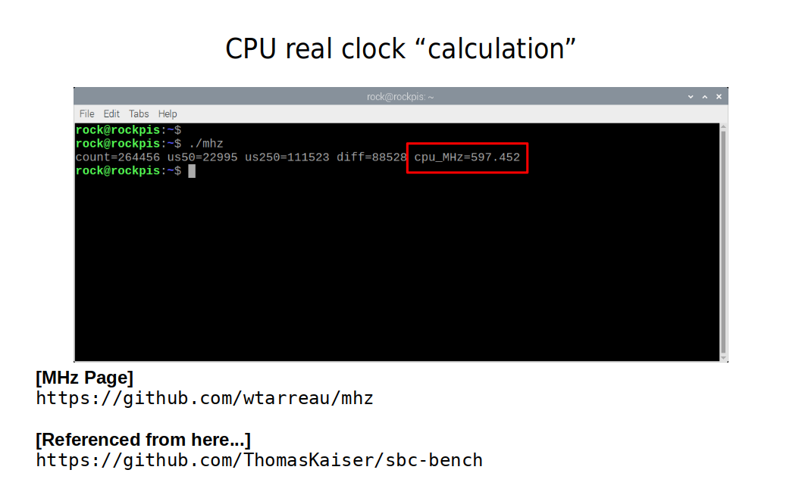
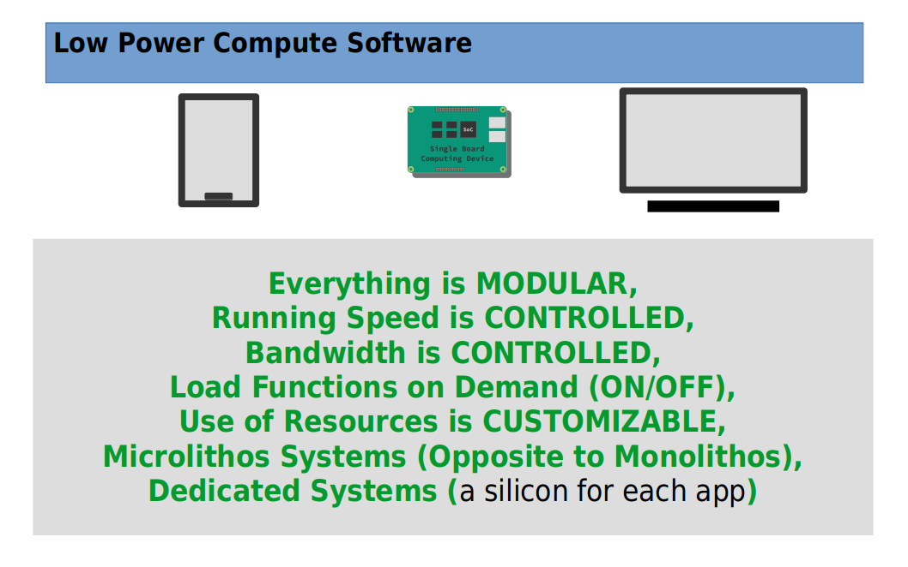

# RockPI S - 64MB RAM (simulated) Model
**Exploring RockPI S with resources limited...**  
  
Using Official Debian Buster O.S. Image  
  
  
  
Pict 1 -   
  
-----
  
  
Pict 2 -   
  
-----
  
Just a joke, anedocte...  
I am playing with RockPI S limiting and controlling its resources...  
Underclock to any of its lower steps: 408MHz, 600MHz, 816MHz, 1008MHz, 1.2GHz...  
  
Also, simulating less memory with Linux Kernel Parameter "mem=XX"...  
  
Disabling CPU Cores is also a feature available to play it...  
  
  
I want to have ideas about how lower in resources we can go, and yet still run certain kinds of applications...  
  
One thing that I want, is to have some idea about is how clock speed and core count influence battery life, and what we can do about it...  
  
  
**SWAP**  
With very little experimentation, I was convinced that we just NEED a swap file to keep things going. For example, even with "full 256MB", trying to run Chromium WebBrowser inside a VNC session proves to be very slow WITHOUT a swap file... on the other hand, when a 256MB Swap File is added as swap, things go way better in terms of time to execute...
So, if ones wants to experiment with lower RAM, say, 128MB or 192MB, I strongly recommend a swap file before trying!  
  
  
  
Pict 3 -   
  
-----
  
  
Pict 4 -   
  
-----
  
Pict 5 -   
  
-----
  
  
****  
The "RADical XAolin 64MB Model" is a joke, anedocte, but the control of resources (memory, clock, cores) and the experiments around it are NOT!  
I have great interest in learning as much as possible about systema with low resources, such as memory, low clock speed, few CPU cores... specially in relation to power consumption, battery life, etc...  
  
My main motivation are systems (hardware & software) with SINGLE APPLICATION in mind, runnning PERMANENTLY dedicated to ONE APP, having as little O.S. and support modules as possible...  
  
**REMARKABLE Compute Device**  
It is within this category of compute devices that I believe RockPI S is REMARKABLY INTERESTING  
  
Because its simplicity and low cost, and yet, its 4 cores 64bits and relative good performance, we can think about APPS and a blending of SOFT+HARD, both acting together to accomplish ONE SPECIFIC GOAL...  
  
Small physical size and low power consumption are also KEY feature for this kind of thinking...  
  
  
**Low Power Compute Software & Hardware**  
Since the creation of the smartphone and popularization of Single Board Computers, powered by low power chips mainly of ARM archicture, we are enjoying LOW POWER COMPUTE HARDWARE, but still, on the SBC side, we keep using software created on the desktop PC for the desktop PC, where resources are always superdimensioned... there are always lots of RAM, lots of CPU power, etc...  
  
Now that we have plenty of LOW POWER COMPUTE HARDWARE, it is time to shift the paradigm to a new mindset: A LOW POWER COMPUTE SOFTWARE (LPC Soft)!  
  
In my opinion, at least part of the LPC Soft/Hard is about CONTROLLING resources...  
The CRUCIAL FACTOR for controlling resources is to have a hardware which is 100% DEDICATED to ONE APPLICATION, so that, there is no concern to any other APP or function, we can then, control everything based SOLO on the specific goal in mind...  
To achieve this level of control, we need to SHAPE and RESHAPE the entire O.S. and all its features, and that ONLY makes sense if the hardware is 100% DEDICATED to one specific application...  
  
We need to keep in mind that, TO HAVE A HARDWARE DEDICATED to just one application, means that we need to have MANY hardware systems, therefore, the hardware itself (board) NEED TO BE SIMPLE, NEED TO BE CHEAP!  
  
We need it SIMPLE, because we are going to setup MANY of then, and CHEAP because we are going to BUY LOTS of them for many applications that we want...  
  
There are many more things to say about this subject, but, I think that I have justified a little bit about the qualities that I can see on this Little QuadCore SBC...  
  
Following 2 pictures illustrate the kinds of things that boards like RockPI S can help us to achieve in practice, what in theory I believe are the "next steps to have"...  
  
  
Pict 6 -   
  
-----
  
  
Pict 7 -   
  
-----
  
  
VERY NICE LITTLE SBC!  
SPECIALLY IF WE WANT TO THINK AND DO LPC SOFT/HARD...  
  

