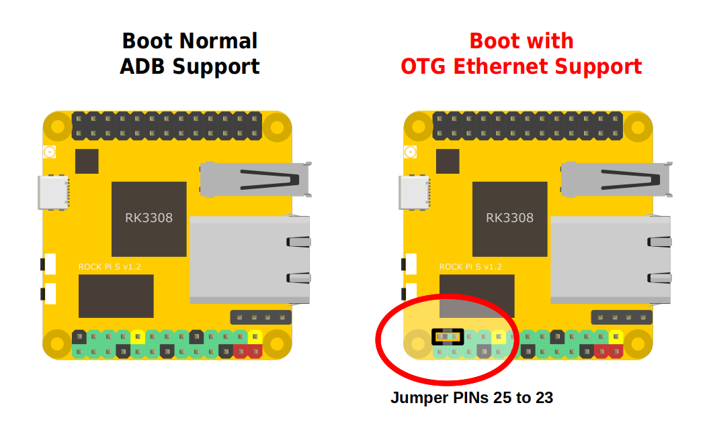

# ADB-OTGether-Switch
**Use GPIO Jumper to switch ADB or OTG Ethernet**  
  
Set the Jumper before switch the board ON...  
NO JUMPER = normal boot with adb support...  
JUMPER ON = OTG Ethernet Gadget on USB-C Connector...  
  
  
Tested on Official Debian Buster O.S. Image...  
  
  
  
Pict 1  
  
-----
  
  
Pict 2  
  
Following pictures illustrates how the "switch" works.  
  
-----

  
Pict 3  
  
-----

  
Pict 4  
  
-----

  
Pict 5  
  
-----

  
Pict 6  
  
-----
  
Pict 7  
  
-----
  
  
You can find the scripts inside the folder "scripts".  
  
  
