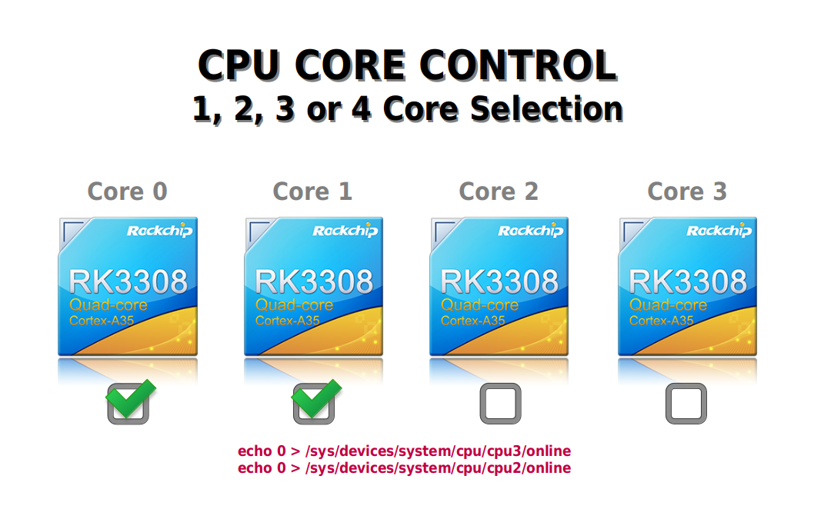
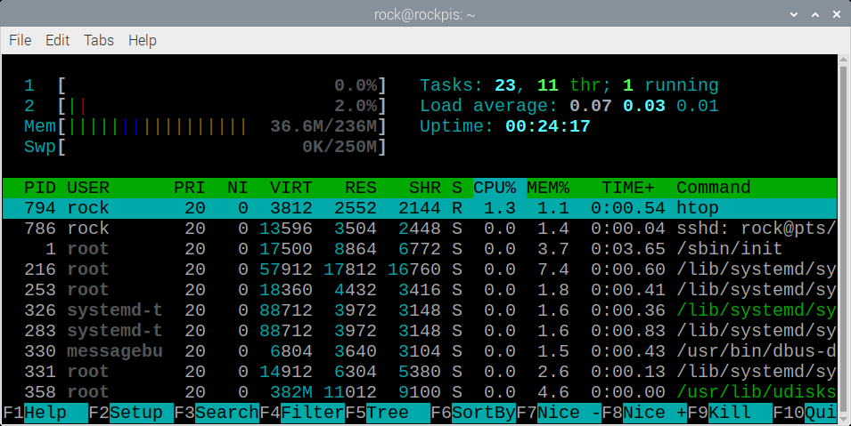

# Rockchip RK3308 Core Control
**Enable/Disable CPU Cores**  
  
Disable Core3...  
(as root)  
```
echo 0 > /sys/devices/system/cpu/cpu3/online  
```
  
  
Disable Core2...  
```
echo 0 > /sys/devices/system/cpu/cpu2/online  
```
  
  
  
Pict 1  
  
-----
  
Check with HTOP...  
```
apt install htop  
  
htop  
```
  
  
  
Pict 2  
  
-----
  
  
  
To ENABLE AGAIN Core2...  
```
echo 1 > /sys/devices/system/cpu/cpu2/online  
```
  
  
