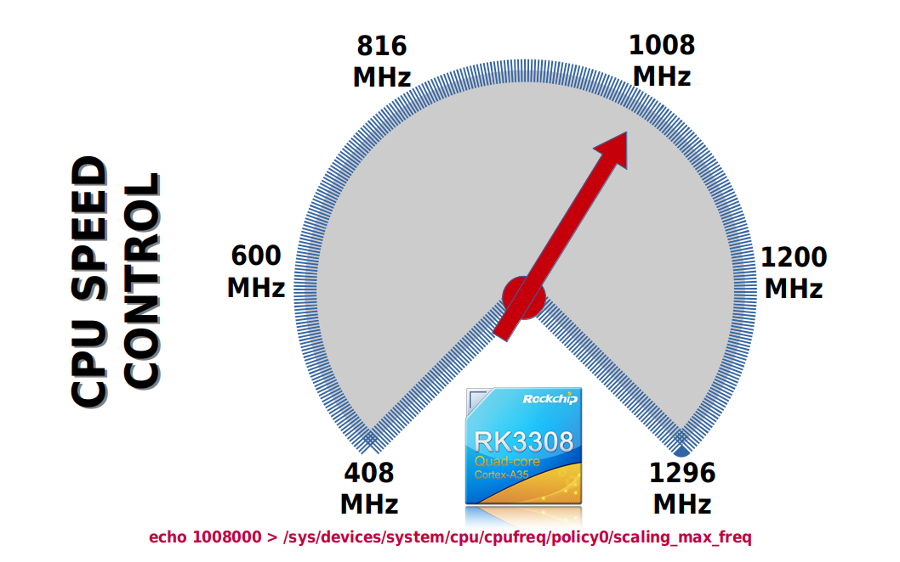

# Rockchip RK3308 CPU Frequency
**TO set CPU frequency**  
  
The following line set the max cpu frequency to 1.008GHz...  
(As root)  
  
```
echo 1008000 > /sys/devices/system/cpu/cpufreq/policy0/scaling_max_freq  
```
  
  
  
Pict 1  
  
-----
  
Available frequencies are: 408000, 600000, 816000 1008000 1200000 1296000  
  
List of avaiable frequencies...  
```
cat /sys/devices/system/cpu/cpufreq/policy0/scaling_available_frequencies  
```
  
  
