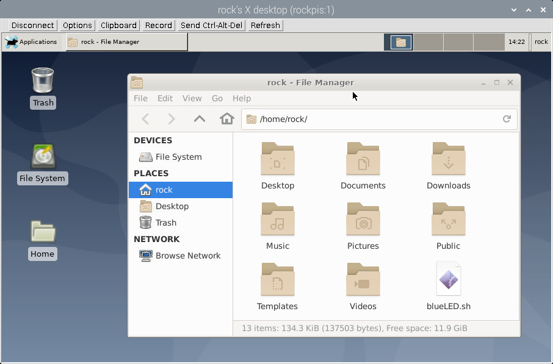
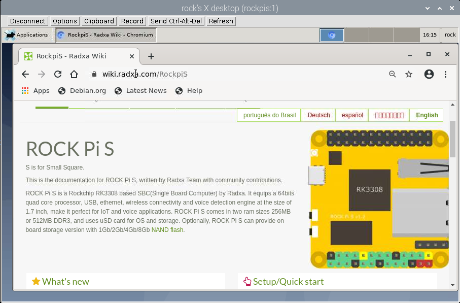
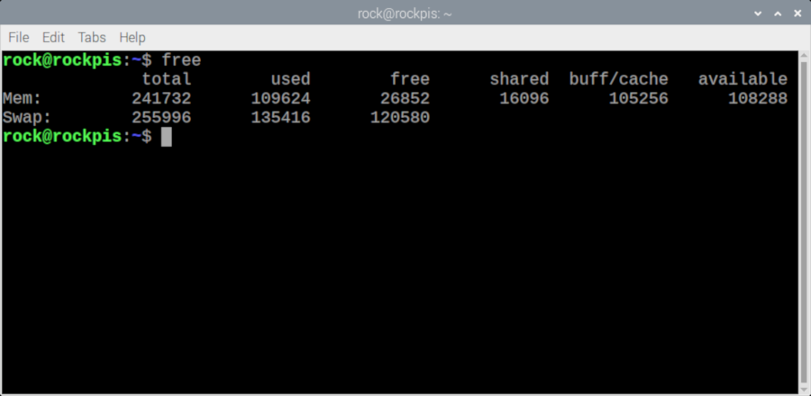
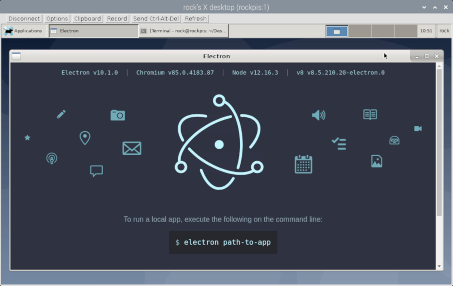
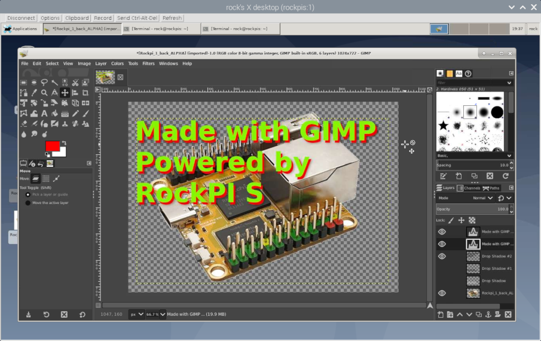

# Desktop using VNCServer
**How to run Desktop Environment**  
  
fresh install debian (sdCard fill)  
  
then:  
  
sudo  apt-get  install  xserver-xorg-core  xfce4  tightvncserver  

[Following is optional, just an extra]
sudo  apt-get  install  xfce4-terminal

  
then: restart  
  
  
Start the VNC server on RockPI S:  
vncserver  -geometry  900x500  
  
  
[On the client viewer]  
vncviewer  rockpis:1  
  
  
  
Pict 1 - RockPI S Desktop File Manager  
  
-----
  
  
  
Pict 2 - Chromium WebBrowser visiting RockPIS website...  
  
-----
  
Pict 3 - It is better to have a swap file, otherwise the browser takes to long to work...  
  
-----
  
  
  
Pict 4 - Running Electron (JavaScript GUI Framework)  
  
-----
  
  
  
Pict 4 - Running Electron (JavaScript GUI Framework)  
  
-----
  
  

